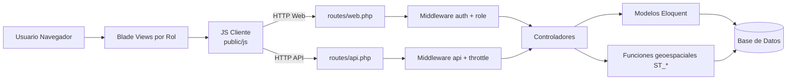

# Arquitectura del Sistema - Geoportal

## 1) Resumen ejecutivo

Geoportal es una aplicacion web construida sobre Laravel 10 para la gestion de:

- Usuarios por jerarquia operativa (root, administrador, tecnico, jefe_operativo, capturista)
- Unidades de produccion (UP)
- Poligonos geoespaciales asociados a UP y usuarios
- Catalogo de cultivos y variantes de cultivo
- Metricas de superficie (hectareas) y conteos de poligonos

El sistema combina renderizado web por vistas Blade con consumo AJAX/REST desde JavaScript en cliente.

## 2) Stack tecnologico

### Backend
- PHP 8.1+
- Laravel Framework 10.x
- Laravel UI (auth clasico)
- Laravel Sanctum (ruta API autenticada disponible)

### Frontend
- Blade templates
- JavaScript en public/js (jQuery + Fetch)
- Bootstrap 5
- Vite para build de assets

### Base de datos
- Relacional via Eloquent ORM
- Uso geoespacial con columna geometry y funciones ST_* (flujo compatible con PostGIS)

## 3) Arquitectura por capas

###! Capa de presentacion (UI)
Responsabilidad:
- Renderizar pantallas por rol
- Capturar interacciones (alta, baja, edicion, dibujo de poligonos)
- Consumir endpoints web/api

Elementos principales:
- resources/views/{rol}/*.blade.php
- public/js/*.js (up.js, usuarios.js, poligono.js, etc.)

###! Capa de entrada HTTP
Responsabilidad:
- Declarar rutas web y api
- Aplicar middleware de autenticacion y roles
- Enviar solicitudes a controladores

Elementos principales:
- routes/web.php
- routes/api.php
- app/Http/Kernel.php
- app/Http/Middleware/RoleMiddleware.php

###! Capa de aplicacion (controladores)
Responsabilidad:
- Reglas de negocio por modulo
- Validacion de request
- Orquestacion de operaciones entre modelos
- Respuestas JSON o redirecciones/vistas

Controladores principales:
- UserController
- UPController
- PoligonoController
- CultivoController
- VarianteCultivoController

###! Capa de dominio y persistencia
Responsabilidad:
- Entidades del negocio
- Relaciones entre tablas
- Acceso y mutaciones de datos

Modelos principales:
- User
- UnidadProduccion
- Poligono
- Cultivo
- VarianteCultivo

Migraciones relevantes:
- users + created_by + tipo_usuario
- unidad_produccion (incluye evolucion de columnas de responsable/productor/capturista)
- poligono (geometry, cultivo_id, variante_cultivo_id)
- cultivos y variantes_cultivo

## 4) Diagrama de componentes

## 5) Modelo de seguridad y autorizacion

### Autenticacion
- Auth::routes() en rutas web (login/register/reset clasico)
- Endpoint api protegido con auth:sanctum para /api/user

### Autorizacion por rol
- Middleware personalizado role:<rol>
- Validacion por campo users.tipo_usuario
- Grupos de rutas separadas por rol en web.php

### Jerarquia funcional (negocio)
- root: visibilidad y gestion global
- administrador: gestiona su arbol de usuarios
- tecnico: gestiona su arbol tecnico-operativo
- jefe_operativo: gestiona capturistas propios
- capturista: alcance acotado a sus datos

## 6) Modulos funcionales

### 6.1 Usuarios
- CRUD desde UserController
- Campo created_by para trazar quien creo a quien
- Filtrado de listados segun rol

### 6.2 Unidades de produccion (UP)
- CRUD en UPController
- Reglas de acceso por jerarquia de creadores
- Vistas diferenciadas por rol para crear/editar/mapear UP

### 6.3 Poligonos geoespaciales
- CRUD en PoligonoController
- Guardado de geom via ST_GeomFromText(..., 4326)
- Relacion con cultivo y variante
- Reportes de hectareas totales y por cultivo

### 6.4 Catalogo de cultivos y variantes
- CultivoController: CRUD, normalizacion y validacion de duplicados
- VarianteCultivoController: alta/listado por cultivo
- Uso en formularios de captura de poligonos

## 7) Flujo principal de peticion

### Flujo web con control de rol
1. Usuario autenticado solicita una vista
2. routes/web.php aplica auth y role
3. Controlador resuelve datos/permiso
4. Retorna vista Blade o JSON para AJAX

### Flujo API para poligonos
1. JS cliente envia request a /api/poligonos...
2. routes/api.php dirige a PoligonoController
3. Controlador valida payload y consistencia cultivo-variante
4. Modelo persiste entidad en BD (incluyendo geometry)
5. Respuesta JSON para refrescar UI/mapa

## 8) Entidades y relaciones (alto nivel)

- User (1) -> (N) User por created_by
- User (1) -> (N) UnidadProduccion por created_by
- User (1) -> (N) UnidadProduccion por capturista_id
- UnidadProduccion (1) -> (N) Poligono por up_id
- User (1) -> (N) Poligono por user_id
- Cultivo (1) -> (N) VarianteCultivo por cultivo_id
- Cultivo (1) -> (N) Poligono por cultivo_id
- VarianteCultivo (1) -> (N) Poligono por variante_cultivo_id

## 9) Convenciones observadas

- Backend responde JSON para operaciones AJAX y redirecciones para formularios clasicos
- Separacion de vistas por rol (carpetas root/admin/tecnico/etc.)
- Logica de permisos de negocio concentrada en UPController y PoligonoController

## 10) Riesgos y oportunidades tecnicas

- Se mezclan endpoints web y api para operaciones similares (puede elevar complejidad de mantenimiento)
- Parte de autorizacion esta en middleware y parte en logica de controlador (conviene estandarizar con Policies/Gates)
- Existe dependencia a scripts en public/js con bastante logica de UI; migrar gradualmente a modulos en resources/js mejoraria trazabilidad
- El modelo espacial depende de funciones ST_* y tipo geometry; validar entorno de BD para despliegues nuevos

## 11) Recomendaciones de evolucion

1. Introducir Policies por recurso (User, UP, Poligono, Cultivo)
2. Unificar contrato API (versionado, codigos de error, validaciones consistentes)
3. Centralizar reglas de jerarquia en servicios de dominio reutilizables
4. Fortalecer cobertura de pruebas Feature/Unit para permisos y reglas geoespaciales
5. Documentar endpoints con OpenAPI/Swagger

---
Documento generado a partir de la revision de estructura, rutas, controladores, modelos y migraciones del proyecto.
